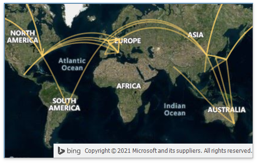

# Custom WayPoint Map Item



A custom WaypointMap item supports the following capabilities:

* [Export](http://docs.devexpress.devx/Dashboard/15187/winforms-dashboard/winforms-designer/create-dashboards-in-the-winforms-designer/printing-and-exporting?v=21.1&p=netframework)
* [Master-Filtering](http://docs.devexpress.devx/Dashboard/15702/winforms-dashboard/winforms-designer/create-dashboards-in-the-winforms-designer/interactivity/master-filtering?v=21.1)
 

The WayPoint Map Item uses tile images from the [MS Bing Maps](https://www.bing.com/maps/) service and requires a Bing Maps key. Enter your key in the `WaypointMapItemExtensionModule.OnCustomDashboardItemControlCreating` method. 
Refer to the following article for more information: [How to: Get a Bing Maps Key](https://docs.devexpress.com/WindowsForms/15102/controls-and-libraries/map-control/examples/general/how-to-get-a-bing-maps-key).


## Example Structure

The WaypointMap module consists of the following classes:

* [WaypointMapItemMetadata](WaypointMapItemMetadata.cs)

    Configures the data item structure in a custom WaypointMap dashboard item and creates a [binding panel](http://docs.devexpress.devx/Dashboard/15622/winforms-dashboard/winforms-designer/ui-elements/data-items-pane?v=21.1). 

* [WaypointMapItemControlProvider](WaypointMapItemControlProvider.cs)

    Configures a custom control that displays the WaypointMap custom item. The [CustomControlProviderBase.UpdateControl(CustomItemData)](http://docs.devexpress.devx/Dashboard/DevExpress.DashboardWin.CustomControlProviderBase.UpdateControl(DevExpress.DashboardCommon.CustomItemData)?v=21.1&p=netframework) method is called each time the custom item's data or settings change. The method supplies calculated data for a custom item based on measures and dimensions specified in `WaypointMapItemMetadata`. The [GetPrintableControl](http://docs.devexpress.devx/Dashboard/DevExpress.DashboardWin.CustomControlProviderBase.GetPrintableControl(DevExpress.DashboardCommon.CustomItemData-DevExpress.DashboardCommon.CustomItemExportInfo)?v=21.1&p=netframework) method exports the custom item. 
The `SetSelection()` method applies element selection according to the master filter state. The [MapControl.SelectionChanged](http://docs.devexpress.devx/WindowsForms/DevExpress.XtraMap.MapControl.SelectionChanged?p=netframework) event processes element selection and applies the master filter to the dashboard.


* [WaypointMapItemExtensionModule](WaypointMapItemExtensionModule.cs)

    Contains the `Attach()` and `Detach()` methods that create custom item bars in the Ribbon, attach the DashboardDesigner to the module and subscribe and unsubscribe the [DashboardDesigner.CustomDashboardItemControlCreating](xref:DevExpress.DashboardWin.DashboardDesigner.CustomDashboardItemControlCreating) event used to visualize the custom item in a dashboard.

## Integrate the WaypointMap Module 

* Add the `WaypointMap` module to your solution.
* Add a reference to this project to References in your project.
* Call the following code to register the `WaypointMapItemMetadata` type in your application:

**C# code**:
```csharp
namespace CustomItemsSample {
    static class Program {
        /// <summary>
        /// The main entry point for the application.
        /// </summary>
        [STAThread]
        static void Main() {
            //...
            Dashboard.CustomItemMetadataTypes.Register<WaypointMapItemMetadata>();
            Application.Run(new Form1());
        }
    }
}
```

**VB code**: 
```vb
Namespace CustomItemsSample
    Friend NotInheritable Class Program
        ''' <summary>
        ''' The main entry point for the application.
        ''' </summary>
        Private Sub New()
        End Sub
        <STAThread> _
        Shared Sub Main()
          '...
          Dashboard.CustomItemMetadataTypes.Register(Of WaypointMapItemMetadata)()
          Application.Run(New Form1())
        End Sub
    End Class
End Namespace
```
* Call the following code to attach the extension to the DashboardDesigner control:

**C# code**:
```csharp
public Form1() {
        InitializeComponent();
        WaypointMapItemModuleItemModule.AttachDesigner(dashboardDesigner1);
}
``` 

**VB code**: 
```vb
Public Sub New()
	InitializeComponent()
	WaypointMapItemModuleItemModule.AttachDesigner(dashboardDesigner1)
End Sub
```
