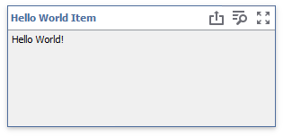
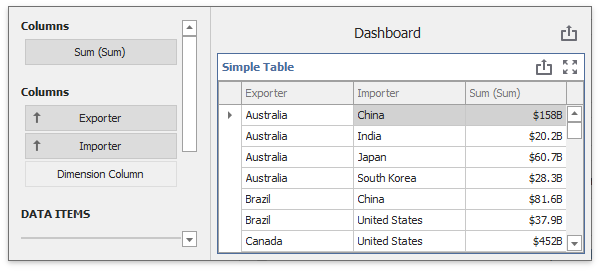
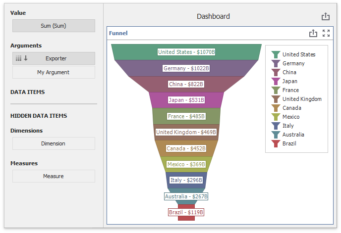

<!-- default badges list -->

<!-- default badges end -->

# Dashboard for WinForms - Custom Item Tutorials

**Custom items** allow you to embed any WinForms UI control in a dashboard. You can interact with custom items in the Dashboard Designer just like with any built-in item.

This project contains the custom dashboard items that you get after you complete the [Custom Item](https://docs.devexpress.com/Dashboard/403031/winforms-dashboard/winforms-designer/ui-elements-and-customization/create-a-custom-item) tutorials.

## Static Custom Item

**View Tutorial**: [Create a Static Custom Item](https://docs.devexpress.com/Dashboard/403087/winforms-dashboard/winforms-designer/ui-elements-and-customization/create-a-custom-item/create-a-static-item)

**View File**: [С#](./CS/TutorialsCustomItems/CustomItems/)/ [VB](./VB/TutorialsCustomItems/CustomItems/)

The file contains contains a code for a **HelloWorld** custom item that displays the 'Hello World!' text. 

## Data-Aware Custom Item

**View Tutorial**: [Create a Data-Aware Item](https://docs.devexpress.com/Dashboard/403088/winforms-dashboard/winforms-designer/ui-elements-and-customization/create-a-custom-item/create-a-data-aware-item)

**View File**: [С#](./CS/TutorialsCustomItems/CustomItems/)/ [VB](./VB/TutorialsCustomItems/CustomItems/)

The file contains a code for a custom item based on the [Grid](https://docs.devexpress.com/WindowsForms/DevExpress.XtraGrid.GridControl) control.

## Data-Aware Item based on External Visualization Widget

**View Tutorial**: [Create an Interactive Data-Aware Item](https://docs.devexpress.com/Dashboard/403032/winforms-dashboard/winforms-designer/ui-elements-and-customization/create-a-custom-item/create-an-interactive-data-aware-item)

**View File**: [С#](./CS/TutorialsCustomItems/CustomItems/)/ [VB](./VB/TutorialsCustomItems/CustomItems/)

The file contains a code for a more "real-world" custom item that uses an external visualization control. A Funnel chart displays a wide area at the top that indicates the total points' value, while other areas are proportionally smaller.

## Files to Review

* [Form1.cs](./CS/TutorialsCustomItems/Form1.cs) (VB: [Form1.vb](./VB/TutorialsCustomItems/Form1.vb))
* [Modules](./CS/TutorialsCustomItems/CustomItems/) (VB: [Modules](./VB/TutorialsCustomItems/CustomItems/))

## Documentation

* [Create a Custom Item](https://docs.devexpress.com/Dashboard/403031/winforms-dashboard/winforms-designer/ui-elements-and-customization/create-a-custom-item)
* [Custom Item Troubleshooting](https://docs.devexpress.com/Dashboard/403250/winforms-dashboard/winforms-designer/ui-elements-and-customization/create-a-custom-item/custom-item-troubleshooting)

## More Examples 

* [Dashboard for WinForms - Custom Items Extension](https://github.com/DevExpress-Examples/winforms-dashboard-custom-items-extension)
